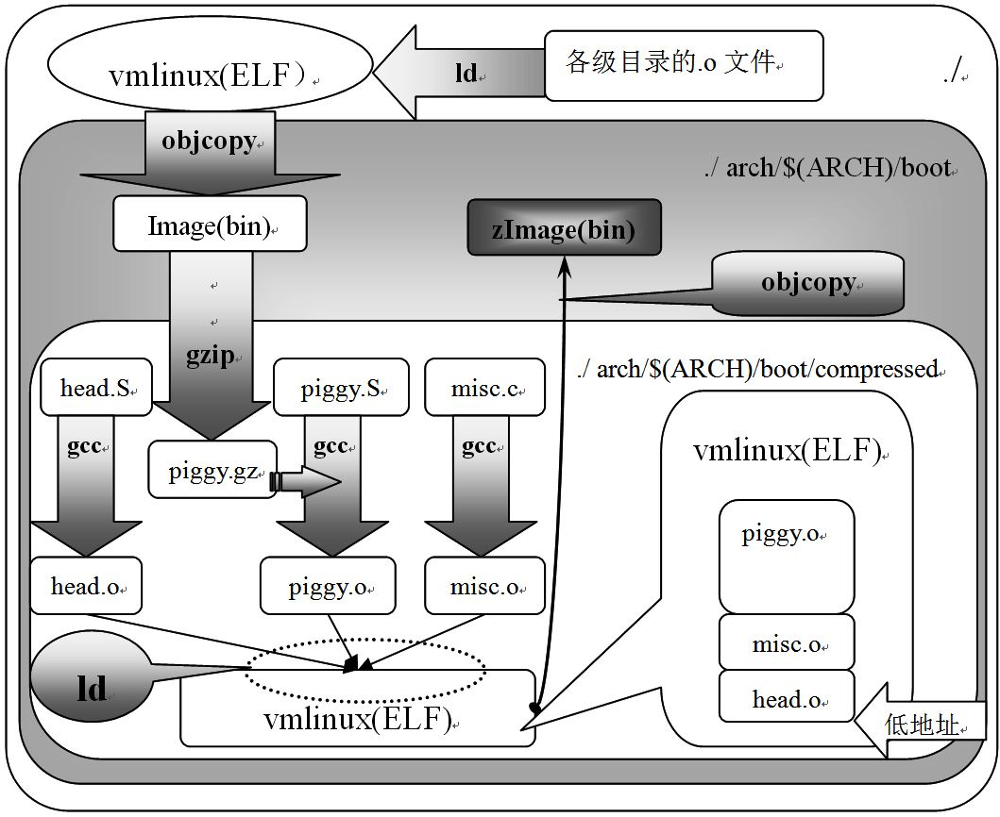

# **Android 源码学习**

*这是一个个人学习 Android 4.4.4 r1 源码的记录仓库*

文件按编译出来的模块存放：

1. bootable 编译成  aboot.img 文件(实际是一个bootloader ELF文件)

2. kernel 编程成 boot.img 的前半部，也就是Linux kernel (zImage)部分

   ps：a. Linux 内核镜像编译成 vmLinux 是一个ELF文件，

   b. 经过 objcopy 工具生成只剩代码的二进制文件，

   c. 再用 gzip -f -9 压缩成 zImage（解压代码位于 linux-src/arch/arm/boot/compressed/head.S），

   d. 最后在zImage之前加上 0x40 的头部信息（tag）形成uImage，是uboot专用的镜像文件 

   

3. init 编译成 /init 系统启动的第一个进程程序

4. app_process 编译成 /system/bin/app_process （即 zygote 进程）

